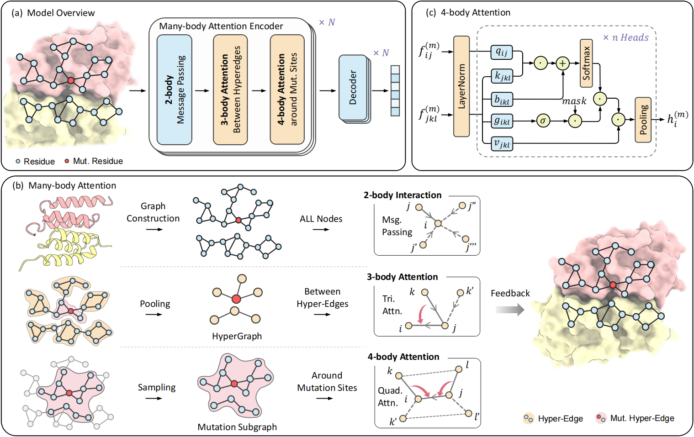

# Accurately Predicting Protein Mutational Effects via a Hierarchical Many-Body Attention Network

[](https://openreview.net/forum?id=CrxR6CYeQn)
[](https://pytorch.org/)
[](https://life.bsc.es/pid/skempi2/)



We propose **H3-DDG**, a **H**ypergraph-driven **H**ierarchical network to capture **H**igher-order many-body interactions across multiple scales. By introducing a hierarchical communication mechanism, H3-DDG effectively models both local and global mutational effects.

## Environment Requirements

The code has been tested with the following dependencies:
- Python 3.9
- PyTorch 1.13.1
- scikit-learn 1.2.1
- pandas 1.5.3
- numpy 1.22.4

## Dataset Preparation

Please place all downloaded datasets in the `./data` folder.

The SKEMPI dataset can be downloaded by running:
```bash
bash get_skempi_v2.sh
```


## Model Setup

1. Download a pre-trained inverse folding model from the ProteinMPNN official repository. You can choose different pre-trained weights. In this project, we use `soluble_model_weights/v_48_020.pt`.
2. Place the checkpoint file in your desired location
3. Update the `ckpt_path` in `train_h3-ddg.json` to point to your downloaded checkpoint file

## Training & Validation

To train the model, run:
```bash
python train_skempi.py --config_path ./config/train_h3-ddg.json --tag TAG
```

`TAG` is a user-defined name for the training session. A subfolder with the same name will be created under results, storing all outputs such as `results.csv` (prediction results) and `train.log` (training logs and metrics).

To compute the best fold combination metrics, run:

```bash
python validate_all.py --save_dir SAVE_DIR --top_k TOP_K
```

`SAVE_DIR` is the folder where training results are saved, and `TOP_K` is the number of best folds to select.

## Citation and Contact

If you find H3-DDG useful for your research and applications, please cite:

```
@inproceedings{
    xu2025h3ddg,
    title={Accurately Predicting Protein Mutational Effects via a Hierarchical Many-Body Attention Network},
    author={Dahao Xu and Jiahua Rao and Mingming Zhu and Jixian Zhang and Wei Lu and Shuangjia Zheng and Yuedong Yang},
    booktitle={Thirty-ninth Annual Conference on Neural Information Processing Systems},
    year={2025},
    url={https://neurips.cc/virtual/2025/poster/119261}
}
```

Please contact [Jiahua Rao](raojh7@mail.sysu.edu.cn) for any questions or suggestions.